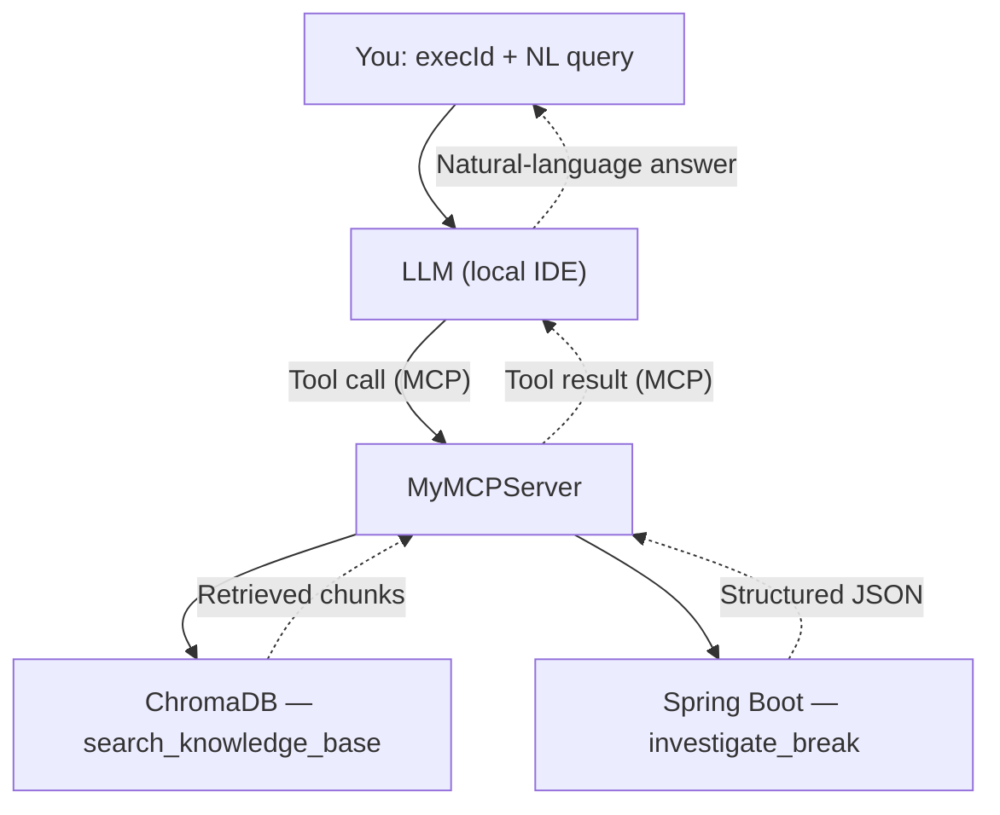
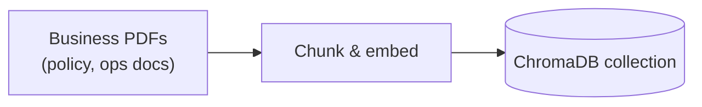

# Recon investigation POC — RAG + MCP architecture

## 1. Overview

A local-IDE LLM (via Copilot chat) investigates execution recon breaks from a
natural-language query plus an `execId`. The LLM has two ways of getting
grounded information, both exposed through a single custom MCP server:

- **Live business data** — via a REST call into the existing Spring Boot
  recon service.
- **Established knowledge** — via semantic search over a ChromaDB index
  built from business PDFs (policy docs, operating procedures, runbooks).

The LLM decides at query time which tool(s) to call. There is no
client-side pre-processing step — Copilot's MCP integration in IntelliJ
only supports the **tools** primitive (not resources or prompts), so
retrieval has to be something the LLM actively calls, not something
injected into the prompt before the LLM sees it.

## 2. Components

| Component | Role |
|---|---|
| **You** | Supplies `execId` + a natural-language question in Copilot chat |
| **LLM (local IDE)** | Reasons over the query, decides which MCP tool(s) to call, synthesizes the final answer |
| **MyMCPServer** | Custom MCP server (dev-team owned). Exposes two tools to the LLM |
| **ChromaDB** | Vector DB backing the `search_knowledge_base` tool — indexed policy/ops PDFs |
| **Spring Boot service** | Backing the `investigate_break` tool — runs the live recon investigation |
| **PDF ingestion pipeline** | Offline/periodic job that chunks and embeds business PDFs into ChromaDB |

## 3. Runtime flow (live query path)



1. You ask a question with an `execId` in Copilot chat.
2. The LLM decides which tool(s) the query needs — it may call one or both
   in the same turn.
3. `search_knowledge_base` → semantic search against ChromaDB → returns
   the most relevant policy/ops document chunks.
4. `investigate_break` → HTTP call into the Spring Boot service → returns
   structured investigation data for that `execId`.
5. Tool result(s) flow back through MyMCPServer to the LLM.
6. The LLM turns the result into a natural-language answer in the Copilot
   chat.

## 4. Offline ingestion pipeline



Runs independently of the live query path — a one-time load, then
re-triggered whenever source documents change (policy docs going stale is
the main risk here, so this shouldn't be a pure one-off).

## 5. Tool design

Two tools, kept deliberately distinct so the LLM can reason about when to
use each:

```
search_knowledge_base:
  "Searches indexed policy and operations documents for established,
   documented answers — e.g. what a status code means, standard
   resolution procedures, escalation policy. Use this first for
   'what is/how does/what's the policy on' style questions."

investigate_break:
  "Runs a live investigation against the recon system for a specific
   execId — pulls current break status, trade details, and match
   history. Use this for 'why did/what happened/investigate' style
   questions tied to a specific execution."
```

**Notes:**
- Tool descriptions are the entire routing mechanism — there's no external
  classifier. Wording matters.
- The LLM can call both tools in one turn for compound questions (e.g.
  "why did execId X breach policy Y" needs both the live break data and
  the policy definition).
- Keep policy-doc chunks and tool-routing examples in separate Chroma
  collections (or distinguish via metadata) so a knowledge-base query
  doesn't get diluted by routing examples, or vice versa.
- Consider a confidence/distance check on `search_knowledge_base` results
  before treating them as a final answer — a weak match shouldn't be
  presented as an established answer.

## 6. Implementation notes

- **Client constraint (confirmed):** GitHub Copilot's MCP integration
  (IntelliJ/VS Code, agent mode) only supports MCP *tools* — not resources
  or prompts. This is why retrieval is implemented as a callable tool
  rather than a pre-LLM injection step.
- **Chroma from Java:** since MyMCPServer is Java/Spring-based, the
  simplest path is running ChromaDB in client-server mode (its own
  container) and calling its REST API from Java — the same pattern
  already used to call the Spring Boot recon service, rather than
  introducing Python into the production stack.
- **Deployment:** ChromaDB can run alongside the existing Postgres/MinIO
  containers in the current Docker Compose setup.

## 7. Open items / next steps

- [ ] Decide chunking strategy for PDFs (starting point: ~200–500 tokens
      per chunk with some overlap)
- [ ] Choose embedding model (local sentence-transformer vs. an
      API-based one matching whichever LLM is used for generation)
- [ ] Define confidence threshold for `search_knowledge_base` before the
      LLM treats a result as an established answer
- [ ] Decide re-ingestion trigger (manual, scheduled, or on doc change)
- [ ] Write and register `search_knowledge_base` in MyMCPServer
